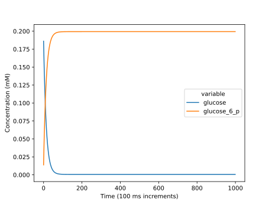

# Kinetix - A simple enzyme kinetics simulation framework

This is a simple framework for single / multiple reaction enzyme kinetics simulation and plotting.
It allows one to plot reaction kinetics that follows the reversible [Michaelis - Menten](https://en.wikipedia.org/wiki/Michaelis%E2%80%93Menten_kinetics) model.

## Usage
One can use the library to produce figures via a command line interface or programmatically (see below for examples)

### CLI
As an example, the reaction kinetics of Glucose Kinase (EC: [2.7.1.2])(https://www.brenda-enzymes.org/enzyme.php?ecno=2.7.1.2) is displayed as an example.
<p align="center">
  
</p>
First, create a definition file in YAML format, that defines the reaction parameters:

```yaml
name: "Glucose kinase simulation"
reactants: #Concentration of the reactants at the beginning of the reaction (mM)
  glucose: 0.2
  glucose_6_p: 0.0
enzymes: #Concentration of the enzyme(s) at the begining of the reaction (mM)
  gluk: 0.05 
reaction: #Kinetic parameters of each of the enzymes for the forward and backward steps of the (reversible) reaction. Note that non-reversible reactions can simple be modeled with high Km for on of the directions.
  gluk: 
    fwd: "glucose"
    back: "glucose_6_p"
    km_fwd: 0.24
    km_back: 21
    kcat_fwd: 61
    kcat_back: 15.9
```

Then, run the simulation with a simple command line and a few arguments:
```
python ./code/runner.py examples/glucose_kinase.yaml --plot_out gluc.png --csv_out gluc.csv
```
A figure showing the progression of the reaction as a function of time is generated:
<p align="center">
  
</p>

A csv file containing the data used to generate the figure can also optionally be generated and saved (using the `--csv_out` flag)

